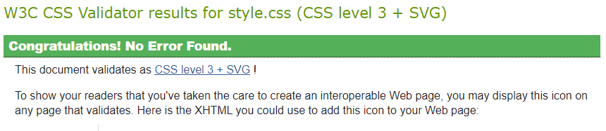
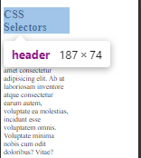
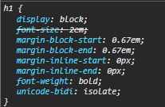
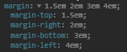

- [Lecture 1 - CSS Anatomy](#lecture-1---css-anatomy)
  - [Anatomy of CSS ruleset](#anatomy-of-css-ruleset)
- [Lecture 2 - Selectors](#lecture-2---selectors)
    - [**style.css**](#stylecss)
    - [. Operator](#-operator)
    - [Group selectors](#group-selectors)
    - [Selecting an element inside another element](#selecting-an-element-inside-another-element)
    - [\* Operator](#-operator-1)
    - [Meaning of Cascading in CSS](#meaning-of-cascading-in-css)
- [Lecture 3  - Colors](#lecture-3----colors)
- [Lecture 4 - Sizes](#lecture-4---sizes)
- [Lecture 5 - Box Model](#lecture-5---box-model)
  - [rem to em calculation](#rem-to-em-calculation)
    - [We talk about margins](#we-talk-about-margins)
- [Lecture 6 - Typography](#lecture-6---typography)


## Lecture 1 - CSS Anatomy
### Anatomy of CSS ruleset 

https://developer.mozilla.org/en-US/docs/Learn/Getting_started_with_the_web/CSS_basics

Use american color spelling 

We can use this page for validating css - [CSS Validation service](https://jigsaw.w3.org/css-validator/)
The validator returns the following message :


Indeed our css file has no errors , this validator is built into vscode btw.

## Lecture 2 - Selectors
id should be used atmost once in the entire document ,  .class for selecting classes , all unrelated properties for a class element are ignored , for example:

#### **style.css**
```css
.class1{
    attr1 : attrval;
}
```

The attrval wont be set on a element with class "class1" if it doesn't have an attribute named attr1 , there exists no error handling in css.


####\# Operator \
\# for referencing id's for example :

```html
<p id="second"></p>
```
and the css file
```css
#second{
    font-style: italic;
}
```
#### \. Operator
dot operator for referencing class , class can be used unlimited times.

```html
<p class="second"></p>
```
and the css file
```css
.second{
    font-style: italic;
}
```


#### Group selectors 
```css
h1, h2 {
    color: aqua;
}
```

#### Selecting an element inside another element
We are looking for a span element inside paragraph element , we use whitespace for this

```
p span{
    color:blue;
    text-transform: uppercase;
    background-color:gold;
}
```

But this is bad , here's where classes glow , maybe make a class named highlight ..
```
.highlight{
    color:blue;
    text-transform: uppercase;
    background-color:gold;
}
```

#### \* Operator
Applies style to all DOM elements

#### Meaning of Cascading in CSS 
Cascading means that the last recieved style of applied. Preference order is as follows:

inline > style tag > external stylesheet

Also Precedence order for selectors :

ids > classes > elements 


## Lecture 3  - Colors
###Colors
4 types :
- HSLA
- RGBA 
- HEX code 

All the 3 have variants with Alpha maximum

Coolors.io for color palettes - [coolors.co](https://coolors.co/) , a tester for WSAG ( Web Content Accessiblity Guidelines)

## Lecture 4 - Sizes

| Unit | Name               | Equivalent to                 |
|------|--------------------|-------------------------------|
| cm   | Centimeters        | 1cm = 37.8px = 25.2/64in      |
| mm   | Millimeters        | 1mm = 1/10th of 1cm           |
| Q    | Quarter-millimeters| 1Q = 1/40th of 1cm            |
| in   | Inches             | 1in = 2.54cm = 96px           |
| pc   | Picas              | 1pc = 1/6th of 1in            |
| pt   | Points             | 1pt = 1/72nd of 1in           |
| px   | Pixels             | 1px = 1/96th of 1in           |

We will use px - pixels , default font size for paragraphs is 16px

Absolute sizes are bad because they override browser preferences , for example if the browser font size is set to small , and the p font-size is set to 32px , the text would look waaaaay bigger than its comfortable.
```css
p{
    font-size: 20px;
    width: 40ch;
}
```




Width takes percentages , 
```css
header {
    width: 50%;
}
```
Fixes the width available for an element 

1rem means 1 times the root font-size , set by the browser or anything that takes more precidence.
Then anywhere you use 1rem will interpret it as 16px.

1em is equal to the current font size

For understanding vm and vh , read more on [mdn web docs](https://developer.mozilla.org/en-US/docs/Web/CSS/CSS_Values_and_Units) , 1% of viewport width is vw , and similarly vh .

## Lecture 5 - Box Model


### rem to em calculation


Our css that we used previously
```css
h1{
    border: 2px dashed red;
    width: 50%;
    font-size: 3rem;
    padding: 0.5rem;
}


```
margin block size is assigned 0.67em , font size of the element is set to 3rem , that is 16*3 ie 48px .
Now 2/3 of 48 px is around 32.16 , we can see that font size affects the margin size.

This is pretty confusing to track , hence we do a css reset at the start of the css file to take care of these things manually.

```*
*{
    margin: 0;
    padding: 0;
    box-sizing: border-box;
}
```
#### We talk about margins


Essentially thate means we can have control over all sides of the margin 
```css
.container{
    margin-top:2em;
    margin-bottom :2em;
    margin-left:2em;
    margin-right:2em;
}
```
Sets margin to all elements with class 'container' to 2em on all sides , and its shorthand is 'margin'.



We can have similar settings for border
```css
.container2{
    border-top:2px solid red;
    border-bottom:2px solid blue;
    border-left:2px dotted green;
    border-right:2px solid orange;
    font-size: 1.5rem;
    margin: 1.5em 2em 3em 4em;
    padding: 1.5em;
}
```

How we made a circle in this lesson by modifying border radius of a div 

```css
.circle{
    margin: 3rem auto;
    background-color: goldenrod;
    width: 100px;
    height: 100px;
    border: 2px solid black;
    border-radius: 50px;
    outline: 2px solid red;
    outline-offset: 0.25rem;
}
```
Add this class to a div and you have a circle thats centered ( note how i used the auto keyword for making margin left and right the same , and equal)

## Lecture 6 - Typography
Summary - font properties , how to import external fonts .
font - 
- Size
- family
- spacing
- upperline
- underline
- overline
- line spacing
- character spacing
- etc

```css
@import url('https://fonts.googleapis.com/css2?family=Roboto:ital,wght@0,100;0,300;0,400;0,500;0,700;0,900;1,100;1,300;1,400;1,500;1,700;1,900&display=swap');


p{
    line-height: 1.4;
    font-family:'Roboto',sans-serif;
}
```

One example above to import and use Roboto font from https://fonts.google.com/.

