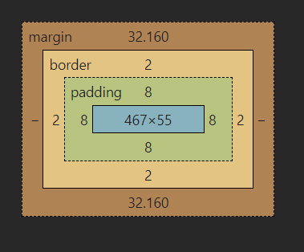
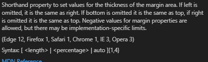
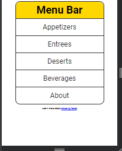

- [Lecture 1 - CSS Anatomy](#lecture-1---css-anatomy)
  - [Anatomy of CSS ruleset](#anatomy-of-css-ruleset)
- [Lecture 2 - Selectors](#lecture-2---selectors)
    - [**style.css**](#stylecss)
    - [. Operator](#-operator)
    - [Group selectors](#group-selectors)
    - [Selecting an element inside another element](#selecting-an-element-inside-another-element)
    - [\* Operator](#-operator-1)
    - [Meaning of Cascading in CSS](#meaning-of-cascading-in-css)
- [Lecture 3  - Colors](#lecture-3----colors)
- [Lecture 4 - Sizes](#lecture-4---sizes)
- [Lecture 5 - Box Model](#lecture-5---box-model)
  - [rem to em calculation](#rem-to-em-calculation)
    - [We talk about margins](#we-talk-about-margins)
- [Lecture 6 - Typography](#lecture-6---typography)
- [Lecture 7 - Links](#lecture-7---links)
  - [Introducing the ":" Operator](#introducing-the--operator)
- [Lecture 7 - Lists](#lecture-7---lists)
- [Lecture 8 - Lists](#lecture-8---lists)
- [Lecture 9 - Mini Project](#lecture-9---mini-project)
    - [CSS Details and Explanations](#css-details-and-explanations)
    - [Importing Font](#importing-font)
    - [CSS Resets](#css-resets)
    - [Body Styling](#body-styling)
    - [Navigation Bar Styling](#navigation-bar-styling)
    - [Heading Styling](#heading-styling)
    - [Unordered List Styling](#unordered-list-styling)
    - [List Item Styling](#list-item-styling)
    - [Anchor Tag Styling](#anchor-tag-styling)
  - [Final Menu bar looks like this](#final-menu-bar-looks-like-this)
- [Lecture 10 - Display](#lecture-10---display)
  - [Paragraph Element](#paragraph-element)
  - [Span Element](#span-element)
  - [Main Element](#main-element)


## Lecture 1 - CSS Anatomy
### Anatomy of CSS ruleset 

https://developer.mozilla.org/en-US/docs/Learn/Getting_started_with_the_web/CSS_basics

Use american color spelling 

We can use this page for validating css - [CSS Validation service](https://jigsaw.w3.org/css-validator/)
The validator returns the following message :


Indeed our css file has no errors , this validator is built into vscode btw.

## Lecture 2 - Selectors
id should be used atmost once in the entire document ,  .class for selecting classes , all unrelated properties for a class element are ignored , for example:

#### **style.css**
```css
.class1{
    attr1 : attrval;
}
```

The attrval wont be set on a element with class "class1" if it doesn't have an attribute named attr1 , there exists no error handling in css.


####\# Operator \
\# for referencing id's for example :

```html
<p id="second"></p>
```
and the css file
```css
#second{
    font-style: italic;
}
```
#### \. Operator
dot operator for referencing class , class can be used unlimited times.

```html
<p class="second"></p>
```
and the css file
```css
.second{
    font-style: italic;
}
```


#### Group selectors 
```css
h1, h2 {
    color: aqua;
}
```

#### Selecting an element inside another element
We are looking for a span element inside paragraph element , we use whitespace for this

```
p span{
    color:blue;
    text-transform: uppercase;
    background-color:gold;
}
```

But this is bad , here's where classes glow , maybe make a class named highlight ..
```
.highlight{
    color:blue;
    text-transform: uppercase;
    background-color:gold;
}
```

#### \* Operator
Applies style to all DOM elements

#### Meaning of Cascading in CSS 
Cascading means that the last recieved style of applied. Preference order is as follows:

inline > style tag > external stylesheet

Also Precedence order for selectors :

ids > classes > elements 


## Lecture 3  - Colors
###Colors
4 types :
- HSLA
- RGBA 
- HEX code 

All the 3 have variants with Alpha maximum

Coolors.io for color palettes - [coolors.co](https://coolors.co/) , a tester for WSAG ( Web Content Accessiblity Guidelines)

## Lecture 4 - Sizes

| Unit | Name               | Equivalent to                 |
|------|--------------------|-------------------------------|
| cm   | Centimeters        | 1cm = 37.8px = 25.2/64in      |
| mm   | Millimeters        | 1mm = 1/10th of 1cm           |
| Q    | Quarter-millimeters| 1Q = 1/40th of 1cm            |
| in   | Inches             | 1in = 2.54cm = 96px           |
| pc   | Picas              | 1pc = 1/6th of 1in            |
| pt   | Points             | 1pt = 1/72nd of 1in           |
| px   | Pixels             | 1px = 1/96th of 1in           |

We will use px - pixels , default font size for paragraphs is 16px

Absolute sizes are bad because they override browser preferences , for example if the browser font size is set to small , and the p font-size is set to 32px , the text would look waaaaay bigger than its comfortable.
```css
p{
    font-size: 20px;
    width: 40ch;
}
```


Width takes percentages , 
```css
header {
    width: 50%;
}
```
Fixes the width available for an element 

1rem means 1 times the root font-size , set by the browser or anything that takes more precidence.
Then anywhere you use 1rem will interpret it as 16px.

1em is equal to the current font size

For understanding vm and vh , read more on [mdn web docs](https://developer.mozilla.org/en-US/docs/Web/CSS/CSS_Values_and_Units) , 1% of viewport width is vw , and similarly vh .

## Lecture 5 - Box Model


### rem to em calculation


Our css that we used previously
```css
h1{
    border: 2px dashed red;
    width: 50%;
    font-size: 3rem;
    padding: 0.5rem;
}


```
margin block size is assigned 0.67em , font size of the element is set to 3rem , that is 16*3 ie 48px .
Now 2/3 of 48 px is around 32.16 , we can see that font size affects the margin size.

This is pretty confusing to track , hence we do a css reset at the start of the css file to take care of these things manually.

```*
*{
    margin: 0;
    padding: 0;
    box-sizing: border-box;
}
```
#### We talk about margins


Essentially thate means we can have control over all sides of the margin 
```css
.container{
    margin-top:2em;
    margin-bottom :2em;
    margin-left:2em;
    margin-right:2em;
}
```
Sets margin to all elements with class 'container' to 2em on all sides , and its shorthand is 'margin'.


We can have similar settings for border
```css
.container2{
    border-top:2px solid red;
    border-bottom:2px solid blue;
    border-left:2px dotted green;
    border-right:2px solid orange;
    font-size: 1.5rem;
    margin: 1.5em 2em 3em 4em;
    padding: 1.5em;
}
```

How we made a circle in this lesson by modifying border radius of a div 

```css
.circle{
    margin: 3rem auto;
    background-color: goldenrod;
    width: 100px;
    height: 100px;
    border: 2px solid black;
    border-radius: 50px;
    outline: 2px solid red;
    outline-offset: 0.25rem;
}
```
Add this class to a div and you have a circle thats centered ( note how i used the auto keyword for making margin left and right the same , and equal)

## Lecture 6 - Typography
Summary - font properties , how to import external fonts .
font - 
- Size
- family
- spacing
- upperline
- underline
- overline
- line spacing
- character spacing
- etc

```css
@import url('https://fonts.googleapis.com/css2?family=Roboto:ital,wght@0,100;0,300;0,400;0,500;0,700;0,900;1,100;1,300;1,400;1,500;1,700;1,900&display=swap');


p{
    line-height: 1.4;
    font-family:'Roboto',sans-serif;
}
```

One example above to import and use Roboto font from https://fonts.google.com/.

## Lecture 7 - Links
Similar to text .

Visited vs unvisited 


Purple is visited .

Also hovering changes the cursor

Also click holding changes color to red 


### Introducing the ":" Operator
This operator is used for selecting pseudo classes for a DOM object. For example , visited pseudo class for anchor tag

```css
a:visited{
    color:purple;
}
```

Also the hover pseudoclass.
```css
a:hover{
    color:green;
}
```

## Lecture 7 - Lists 
Doesnt feel like it needs a section but here it is :

\<ol>  and \<ul> tags are used for opening an ordered and unordered list respectively , with an item inside by an \<li> tag.

Some things you can do to the lists are mentioned below:
```css
ol{
    list-style-type:lower-roman;
}
```

We can also add attributes to the list to change some things like 
- start 
  - Changes the start value of the ordered list
- reversed
  - reverse counting to zero
  
Gives some weird numbering since theres no negative roman numbers
```html
<ol start="1" reversed="true">
```


## Lecture 8 - Lists 
Self explanatory 

## Lecture 9 - Mini Project 
We try to combine all the important stuff we studied so far , and make a formatted navbar.

#### CSS Details and Explanations

The comments in the CSS file provide guidance and reasoning behind each styling decision. Below are the details:

#### Importing Font

```css
/* importing roboto font */
@import url('https://fonts.googleapis.com/css2?family=Roboto:ital,wght@0,100;0,300;0,400;0,500;0,700;0,900;1,100;1,300;1,400;1,500;1,700;1,900&display=swap');
```


We are importing the "Roboto" font from Google Fonts to ensure that our text is displayed using this specific typeface across all browsers and devices.

#### CSS Resets

```css
/* lets get some css resets first */
* {
    margin: 0;
    padding: 0;
    box-sizing: border-box;
}
```


CSS resets help to standardize the styling across different browsers by removing default margins and padding, and setting `box-sizing` to `border-box` so that padding and borders are included within the element's total width and height.

#### Body Styling

```css
/* now our text looks normal , now we do the magic */
body{
    margin: 0.5rem;
    font-family: "Roboto" , sans-serif;
    text-align: center;
}
/* this does margin spacing + font changes + Center alignment */
```


The body element is styled with a small margin to give some space around the content. The font-family is set to "Roboto" with a fallback to sans-serif, and text alignment is centered for better visual presentation.

#### Navigation Bar Styling

```css
/* now we tackle the nav element */
/* root element size is usually 16px , rem stands for that only */
nav{
    border: 2px solid #333;
    border-radius: 2rem;
    margin: 0 auto 1rem;
    max-width: 600px;
    font-size: 3rem; 
    line-height: 7rem; /* spacing between consecutive lines , properties are normal or % or px*/
}
```

The navigation bar (`nav`) is styled with a solid border, rounded corners, centered alignment with auto margins, and a maximum width of 600px. The font size is set relative to the root element's size, and line height is adjusted for better spacing between lines.

#### Heading Styling

```css
/* lets tackle the h1 formatting now */
h2{
    background-color: gold;
    border-radius: 2rem 2rem 0 0; /* top-left | top-right | bottom-right | bottom-left */
}
```


The heading (`h2`) within the navigation bar is given a gold background color and rounded corners on the top left and right sides to visually distinguish it from other elements.

#### Unordered List Styling

```css
/* now we manage the unordered list , note here that we try and go into each layer like an onion , outer layers first */
ul{
    list-style-position: none;/* here we specify the position of the markers for the unordered list*/
    list-style-type: none; /* we are setting the type of the markers , in this case we dont need markers so none*/
}
```


The unordered list (`ul`) is styled to remove the default list markers. This ensures that the list items do not have any bullets or numbers, giving a cleaner look.

#### List Item Styling

```css
/* adding a line above each sublink to beautify */
li{
    border-top:1px solid #333;
}
```


Each list item (`li`) is given a top border to visually separate them, enhancing the appearance of the navigation menu.

#### Anchor Tag Styling

```css
/* sets the a element to block instead of inline which it was previously , so we have full sized borders */
li a{
    display: block;
}

/* read group selectors to understand the below selection */

/* answer is that we select all the a tags inside li tags , and the a tags inside li that are visited (pseudo classes) */
li a, li a:visited{
    text-decoration: none; /* we are removing the underlines and stuff */
    color: #333; /* font color */
}

/* make the boxes black on hovering */
li a:hover, li a:focus{
    background-color: #333;
    color: whitesmoke;
    cursor: pointer;
}

/* last child in the unordered doesnt have rounded edges , but our menu bar has , so we round that too*/
li:last-child a{
    border-radius:0 0 2rem 2rem;
}
```


- `li a`: Sets anchor tags within list items to block display, ensuring the full-sized clickable area.
- `li a, li a:visited`: Removes text decoration (underlines) and sets the font color to `#333`.
- `li a:hover, li a:focus`: Changes the background color to `#333` and font color to `whitesmoke` when hovered or focused, and changes the cursor to pointer for better user interaction.
- `li:last-child a`: Adds rounded corners to the bottom of the last anchor tag within the list, maintaining consistent styling with the navigation bar's overall rounded appearance.

### Final Menu bar looks like this

<center> </center>

## Lecture 10 - Display 


We learn about display , its either inline or block , we see examples to understand it.

### Paragraph Element

```css
p {
    background-color: lightgray;
}
```
Paragraphs are block elements. This rule sets their background color to light gray.

### Span Element

```css
span {
    background-color: green;
}
```
Spans are inline elements. This rule sets their background color to green.

### Main Element

```css
main {
    background-color: skyblue;
    width: 50%;
}
```
The main element is a block element. This rule sets its background color to sky blue and its width to 50%.

- **Block Elements**: Paragraphs (p) and the main element are block elements. They stack on top of each other and can occupy the full width of their parent container, but they don't always have to.
- **Inline Elements**: Spans (span) are inline elements and do not stack like block elements. Instead, they flow within the text.See the span tagged text inside the paragraph in second line

In this case, the paragraph elements cover 100% of the main element's width, illustrating how block elements behave within a parent block element.


Lets now try to modify properties for inline elements 
```css
.opposite{
    background-color: black;
    color: whitesmoke;
    margin-top: 100px;
    height: 200px;
    padding: 4rem;
}
```


we see that padding 4rem overlaps with the other paragraph text , also height and margin-top dont seem to work anything on them .

```css
display: inline-block;
```

Adding this to the opposite class , changes it to an inline block , acting like a block inside an inline space , something like the below scene happens now :


The block properties work now .

Now the summary :
- Block level elements stack on top of each other
- Inline elements donot stack on top of each other
- Block elements have an automatic 100% width derived from the parent element
- Inline elements take up width equal to their content
- Inline-block have hybrid , they take up the space of the margin + padding + content but dont create a new line.